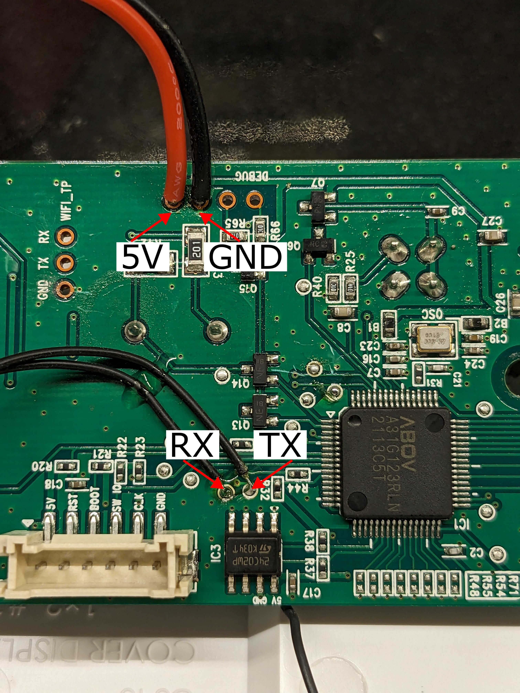
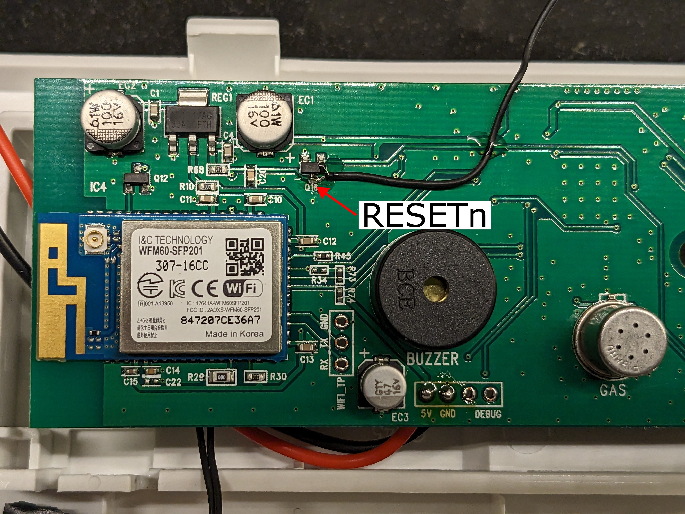
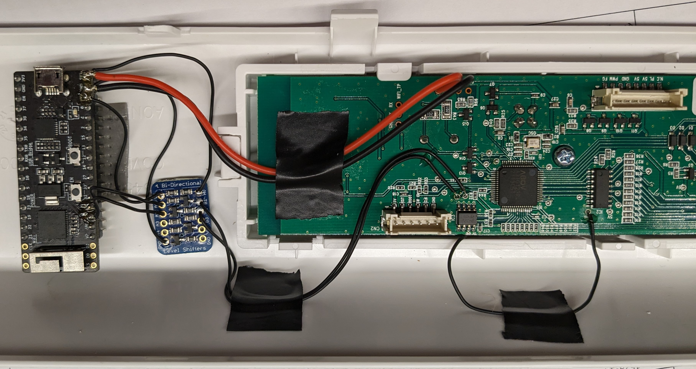

# esphome-winix-c545
An ESPHome component for the Winix C545 air purifier.

## Features
- Full local control of the air purifier via Home Assistant or MQTT.
- Physical device controls remain functional and changes are immediately reflected in the frontend. 
- AQI, AQI indicator, filter age, filter lifetime and light intensity sensors.
- Switch to control Plasmawave.
- Auto and Sleep modes are implemented as fan presets.
- Piggybacks on the OEM protocol with minimal hardware modifications required.
  - The OEM app can (theoretically) remain functional.

## Requirements
- ESP32
  - ESP8266 may work but lacks a free [hardware UART](https://esphome.io/components/uart.html#hardware-uarts).
  - A [Raspberry Pi Pico W](docs/example_pico-w.yaml) has also been used successfully.
- ESPHome 2023.10 or above
  - Older versions may function but have not been tested.
- A bi-directional logic level shifter. 
  - Pictured here is the Adafruit TXB0104 Bi-Directional Level Shifter.
- Winix C545 Air Purifier
- Soldering iron, solder and some small wire.

## Setup
In this setup a ESP32-PICO-KIT V4.1 was used due to its availability and small size. 

### Disassemble The Device
Disassemble the air purifier and remove the control board.
  1. Remove the 5 screws around the filter compartment and release the plastic clips at the bottom of the device to remove the front panel.
  2. Remove the 4 screws and plastic clips securing the control panel.
  3. Disconnect the wire harness from the control board to free the control panel assembly.
  4. Remove the 3 screws securing the control board.

### Identify The Board
Identify the board and ensure it matches the information below.

Board revision
> Winix Inc  
> C545 Display PBA  
> Rev 1.0

WiFi module
> I&C Technology  
> WFM60-SFP201

If your board differs, **STOP!** It is very likely you will damage the board if you disregard this warning.

See the [wiki](https://github.com/mill1000/esphome-winix-c545/wiki) for an alternate board design.

### Wiring
Using the photos as reference, connect the marked points to the ESP32 pins.

**NOTE: The host MCU uses 5 V logic so a level shifter is necessary to interface with the 3.3 V ESP32.**

| Board Point | ESP32 Pin   | Notes |
| ----------- | ----------- | ----- |
| TX          | IO26 (via level shifter) | WiFi UART Tx (WiFi->MCU) |
| RX          | IO25 (via level shifter) | WiFi UART Rx (MCU->WiFi) | 
| 5V          | EXT_5V (5V) | 5 V Supply |
| GND         | Ground      | Ground |
| Q16         | N/A         | WiFi RESETn <br/> Tie to ground to disable OEM WiFi |

#### UART & Power Points


#### RESETn Point


#### Final Assembly


### Configure ESPHome Node
Use the [example configuration snippet](example.yaml) to configure your node.
```yaml
external_components:
  # Pull from Github
  - source: github://mill1000/esphome-winix-c545@main
    components: [winix_c545]

uart:
  - tx_pin: 26
    rx_pin: 25
    baud_rate: 115200

winix_c545:

fan:
  - platform: winix_c545
    name: Winix C545 Air Purifier

sensor:
  - platform: winix_c545
    filter_age:
      name: Filter Age
    filter_lifetime:
      name: Filter Lifetime
    aqi:
      name: AQI
    light:
      name: Light Intensity

text_sensor:
  - platform: winix_c545
    aqi_indicator:
      name: AQI Indicator

switch:
  - platform: winix_c545
    plasmawave:
      name: Plasmawave
```
