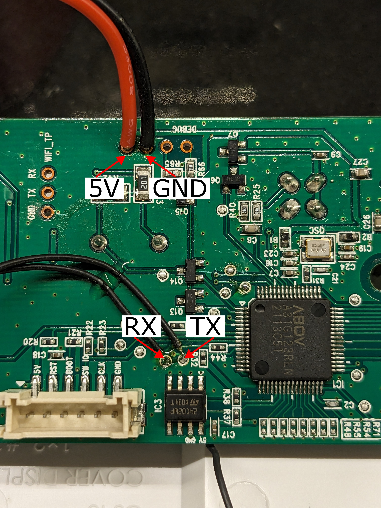
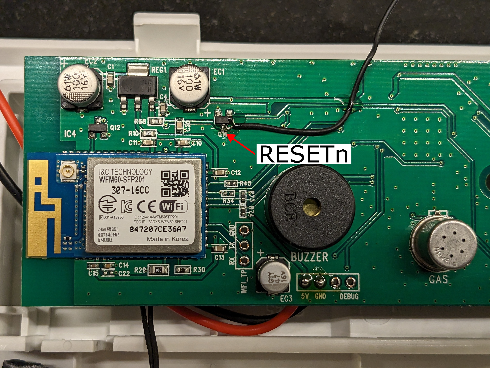
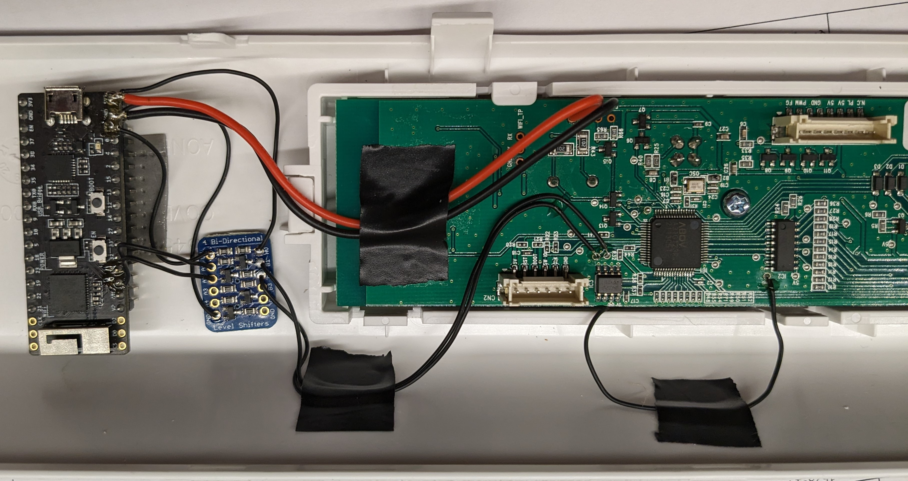

# esphome-winix-c545

An ESPHome component for the [Winix C545 air purifier](https://www.winixamerica.com/product/c545/).

## Features

- Full local control of the air purifier via Home Assistant or MQTT.
- Physical device controls remain functional and changes are immediately reflected in the frontend.
- AQI, AQI indicator, filter age, filter lifetime, light intensity and fan speed sensors.
- Switch to control Plasmawave.
- Auto and Sleep modes are implemented as fan presets.
- Piggybacks on the OEM protocol with minimal hardware modifications required.
  - The OEM app can (theoretically) remain functional.

## Requirements

- ESP32
  - ESP8266 may work but lacks a free [hardware UART](https://esphome.io/components/uart.html#hardware-uarts).
  - A [Raspberry Pi Pico W](docs/example_pico-w.yaml) has also been used successfully.
- ESPHome 2026.1 or above
  - Older versions may function but have not been tested.
- A bi-directional logic level shifter. Push-pull types (e.g. [Adafruit TXB0104](https://www.adafruit.com/product/1875), TXS0108E) are recommended for best results at 115200 baud. BSS138 MOSFET-based boards have also been used successfully.
- Winix C545 Air Purifier
- Soldering iron, solder and 28-30 AWG stranded silicone wire (solid core wire is too stiff and risks pulling pads off the board).

## Setup

In this setup an ESP32-PICO-KIT V4.1 was used due to its availability and small size. Any ESP32 board with an available hardware UART will work -- just substitute the appropriate GPIO pins in the ESPHome configuration.

### Disassemble The Device

Disassemble the air purifier and remove the control board.

1. Remove the 5 screws around the filter compartment and release the plastic clips at the bottom of the device to remove the front panel.
2. Remove the 4 screws and plastic clips securing the control panel.
3. Disconnect the wire harness from the control board to free the control panel assembly.
4. Remove the 3 screws securing the control board.

### Identify The Board

Identify the board and ensure it matches the information below.

Board revision:

```
Winix Inc
C545 Display PBA
Rev 1.0
```

WiFi module
```
I&C Technology
WFM60-SFP201
```

> [!CAUTION]
> If your board differs, **STOP!** It is very likely you will damage the board if you disregard this warning.
 
See the [wiki](https://github.com/mill1000/esphome-winix-c545/wiki) for an alternate board design that has been confirmed working.

### Wiring

There are **5 solder points** on the Winix control board and your ESP32 is connected through a **level shifter** placed in between. The level shifter is required because the Winix MCU uses 5V logic and the ESP32 uses 3.3V.

> [!IMPORTANT]
> **TX/RX label convention.** The TX and RX pads on the Winix board are labeled from the perspective of the original WiFi module that your ESP32 is replacing. Because your ESP32 is acting as that WiFi module, you connect them **straight-through** (TX to TX, RX to RX) rather than crossed. The PCB traces already handle the crossover to the main MCU internally.

#### Connection Overview
 
The wiring consists of three parts: data lines (through the level shifter), power lines, and the WiFi disable jumper.
 
**Data lines (active level shifting required):**
 
| Winix Board | Level Shifter | ESP32 | Purpose |
| ----------- | ------------- | ----- | ------- |
| TX pad | HV channel 1 &rarr; LV channel 1 | UART TX pin (e.g. IO26) | Data from Winix MCU to ESP32 |
| RX pad | HV channel 2 &rarr; LV channel 2 | UART RX pin (e.g. IO25) | Data from ESP32 to Winix MCU |
 
**Power lines:**
 
| Source | Destination | Purpose |
| ------ | ----------- | ------- |
| Winix 5V pad | ESP32 5V input (e.g. EXT_5V) | Powers the ESP32 from the purifier |
| Winix 5V pad | Level shifter HV pin | High-voltage reference for the level shifter |
| ESP32 3.3V output | Level shifter LV pin | Low-voltage reference for the level shifter |
| Winix GND pad | Level shifter GND | Common ground (shared across all devices) |
| Level shifter GND | ESP32 GND | Common ground (shared across all devices) |
 
> [!WARNING]
> **Don't forget the LV connection!** The level shifter needs **both** a high-voltage reference (5V on HV) and a low-voltage reference (3.3V on LV) to translate signals in both directions. Without the 3.3V connection to LV, the ESP32 can receive data from the Winix MCU but cannot transmit back to it.
 
> [!TIP]
> If your level shifter has an OE (output enable) pin, tie it to the LV/3.3V side. If OE is left floating, the level shifter may be disabled.
 
**WiFi disable jumper:**
 
| Winix Board | Connection | Purpose |
| ----------- | ---------- | ------- |
| Q16 | Tie directly to any GND point | Holds the original WiFi module in reset so it does not interfere with the ESP32 on the UART bus |
 
Q16 is the reset line for the onboard WiFi module. Tying it to ground keeps that module disabled. You can jumper it to the same GND pad you are already using for the ESP32/level shifter ground connection.


#### Wiring Diagram
 
```
                    Level Shifter
                 ┌─────────────────┐
Winix TX pad ────┤ HV1         LV1 ├──── ESP32 UART TX pin
Winix RX pad ────┤ HV2         LV2 ├──── ESP32 UART RX pin
Winix 5V pad ──┬─┤ HV          LV  ├──── ESP32 3.3V pin
               │ ├       GND       ┤
               │ └────────┬────────┘
               │          │
               └──────────┼──── ESP32 5V pin
                          └──── ESP32 GND pin ──── Winix GND pad
 
Winix Q16 pad ──── Winix GND pad (jumper wire)
```

#### Board Photos

##### UART & Power Points

 
##### RESETn Point (Q16)

 
##### Final Assembly

 
#### Soldering Tips
 
- Use **28-30 AWG stranded silicone wire**. Solid core wire is too rigid and will put stress on the small solder pads, potentially pulling them off the PCB.
- **Tin both the pad and the wire tip separately**, then hold the tinned wire against the tinned pad and briefly touch the iron to reflow them together.
- **Apply flux** to the pads before tinning for cleaner joints.
- **Add strain relief** with hot glue or kapton tape after soldering so that any tug on the wires pulls against the glue rather than the solder joint.
 
### Configure ESPHome Node
 
See this [configuration snippet](example.yaml) for a more complete example or use the minimal configuration below.
 
Adjust `tx_pin` and `rx_pin` to match the GPIO pins on your specific ESP32 board.

```yaml
external_components:
  # Pull from Github
  - source: github://mill1000/esphome-winix-c545@main
    components: [winix_c545]

uart:
  - tx_pin: 26
    rx_pin: 25
    baud_rate: 115200

winix_c545:

fan:
  - platform: winix_c545
    name: Winix C545 Air Purifier

sensor:
  - platform: winix_c545
    filter_age:
      name: Filter Age
    filter_lifetime:
      name: Filter Lifetime
    aqi:
      name: AQI
    light:
      name: Light Intensity
    fan_speed:
      name: Fan Speed

text_sensor:
  - platform: winix_c545
    aqi_indicator:
      name: AQI Indicator

switch:
  - platform: winix_c545
    plasmawave:
      name: Plasmawave
```

### Troubleshooting

**DEVICEREADY loops forever (handshake never completes):**
The ESP32 is receiving from the Winix MCU but its responses are not getting through. Check that:
1. The level shifter's LV pin is connected to the ESP32's 3.3V output.
2. The level shifter's OE pin (if present) is tied to 3.3V.
3. Your wires are securely soldered and making good contact through the level shifter.
 
**No DEVICEREADY messages at all:**
The ESP32 is not receiving anything from the Winix MCU. Check that:
1. The UART TX and RX pins in your ESPHome config match where your wires are actually connected on the ESP32.
2. The level shifter's HV pin is connected to 5V.
3. The Winix control board is properly connected to the air purifier and powered on.
 
**Button presses on the air purifier are not reflected in Home Assistant:**
This is expected behavior while the DEVICEREADY handshake is still looping. The Winix MCU does not send status updates until the handshake completes. Fix the handshake first (see above).
 
**Everything looks correct but the handshake still won't complete:**
If you removed the control board from one air purifier unit and are testing it in a different unit, make sure the boards match. Even across the same model (C545), different units may have different board revisions that are not interchangeable.
 
**WiFi disconnects or instability:**
Try adding `power_save_mode: none` under the `wifi:` section of your ESPHome config. If disconnects persist, try reducing `output_power` to `15dB` or `8.5dB`.